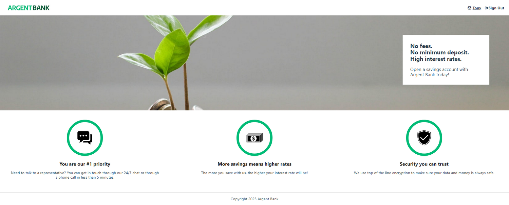

## Utilisez une API pour un compte utilisateur bancaire avec React - ArgentBank
### P13 - OpenClassrooms "Développeur Concepteur Logiciel"

#### Contexte du projet

Vous venez de commencer à travailler chez Remede Agency, une agence spécialisée dans le développement d'applications web. L'équipe est principalement composée de développeurs back-end et vient de commencer à recruter d'autres spécialistes front-end. 

Après quelques jours dans l’entreprise, vous recevez le courriel suivant :

<details><summary><b>Email : Bienvenue !</b></summary>
  
```
De : Mila
À : Vous
```

Bienvenue dans l'équipe !

Je m'appelle Mila Lavigne et je suis ta nouvelle cheffe de projet. Nous sommes très heureux que tu rejoignes l'équipe ! J’ai une excellente nouvelle : le contrat dont nous t’avons parlé lors de l'entretien a été accepté et le client est prêt pour qu’on démarre.

Le projet concerne une nouvelle banque qui démarre, Argent Bank, qui essaie de percer dans le secteur et qui a besoin d'aide pour mettre en place son application. Nous avons obtenu un contrat en deux parties qui se décompose en plusieurs phases :

- **Phase 1 : Authentification des utilisateurs** - Création d'une application web permettant aux clients de se connecter et de gérer leurs comptes et leur profil.
- **Phase 2 : Transactions** - Il s’agirait de spécifier les endpoints d’API nécessaires pour une éventuelle deuxième mission une fois que nous aurons terminé la première.
À la fin du projet, tu présenteras les deux livrables à Avery Moreau, qui gère l’équipe technique d’Argent Bank.

Nous attendons encore des informations, mais je veillerai à ce que tu sois inclus dans toutes les communications pour que tu sois à jour sur le projet.

Au plaisir de travailler avec toi !

Mila
Cheffe de projet
</details>

*Quelques heures plus tard, vous recevez l’e-mail suivant :*

<details><summary><b>Email : Brief mission profil Argent Bank</b></summary>

```
De : Avery
À : Vous, Mila
```

Bonjour Mila et l’équipe,

Je suis Avery Moreau VP Engineering chez Argent Bank. Nous sommes ravis de vous avoir avec nous pour créer notre application web React pour le nouveau système d'authentification des utilisateurs. Nous avons des délais très serrés et nous aurons besoin d’aide !

Voici un aperçu de ce dont nous avons besoin pour la **phase 1 : Authentification des utilisateurs**.

- Créer l’application web complète et responsive avec React.
- Utiliser Redux pour gérer le state de l'ensemble de l'application.
- Ce que doit faire l’application (voir les détails pour chacune sur [nos modèles de GitHub Issues](https://github.com/Alex-Pqn/ArgentBank-backend-ocr_dcl/tree/master/.github/ISSUE_TEMPLATE)) :
  - L'utilisateur peut visiter la page d'accueil
  - L'utilisateur peut se connecter au système
  - L'utilisateur peut se déconnecter du système
  - L'utilisateur ne peut voir les informations relatives à son propre profil qu'après s'être connecté avec succès
  - L'utilisateur peut modifier le profil et conserver les données dans la base de données. 
  
Vous pouvez commencer par forker notre repo existant et suivre l’avancement du travail grâce aux modèles d’Issues GitHub que nous y avons incluses. \
Nos ingénieurs back-end ont déjà créé toutes les API dont vous avez besoin. Vous trouverez toute la documentation Swagger à l'intérieur du repo.

Pour la **phase 2 : Transactions**, nous sommes encore en phase de conception. 

De notre côté, nous mettons au point une fonctionnalité pour les transactions qui doit pouvoir permettre aux utilisateurs :

- de visualiser toutes leurs transactions pour le mois en cours, groupées par compte ;
- de visualiser les détails d'une transaction dans une autre vue ;
- d'ajouter, de modifier ou de supprimer des informations sur une transaction.

Puisque vous gérez déjà l'application web pour la phase 1, nous voulons connaître votre avis sur la façon dont vous pensez que les API devraient être modélisées du côté back end. Nous avons besoin que vous nous fournissiez un document décrivant les API proposées pour les transactions, en suivant les directives de Swagger. 

Parmi les éléments clés à spécifier pour chaque endpoint de l’API il faudra :

- La méthode HTTP (ex. : GET, POST etc.)
- La route (ex. : /store/inventory)
- La description de ce à quoi correspond l’endpoint (ex. : Retour de l'inventaire des animaux de compagnie)
- Les paramètres possibles pour tenir compte des différents scénarios (ex. : itemId (facultatif) = ID de l'article spécifique à demander à la base de données d'inventaire).
- Les différentes réponses avec les codes de réponse correspondants qui ont un sens pour cet endpoint (ex. : 404 : réponse d'erreur d'article inconnu).

Nous ferons une revue de code et discuterons ensemble de la proposition d'API une fois que tout sera terminé.

Au plaisir de travailler avec vous !

Avery Moreau
</details>

#### Objectifs
- Site web créé sous React 18.2 et React Router 6.4
- Redux utilisé pour gérer le state de l'ensemble de l'application
- Rédaction [du document décrivant la partie transactions](https://github.com/Alex-Pqn/ArgentBank-backend-ocr_dcl/blob/master/swagger.yaml) de l'API en suivant les directives Swagger
- Respect des [Issues Github](https://github.com/OpenClassrooms-Student-Center/Project-10-Bank-API/tree/master/.github/ISSUE_TEMPLATE) mises en place
- Utilisation de composants réutilisables
- Communication avec une API REST existante
- Utilisation de services et de requêtes POST et PUT afin de récupérer et mettre à jour des données via l'API
- Architecture des dossiers et fichiers respectée
- Utilisation de Sass et de la méthodologie BEM.
- Responsive

---

### Prerequisites

- You will need to have Node and `npm` installed locally on your machine.

> [!WARNING]  
> The [backend](https://github.com/Alex-Pqn/ArgentBank-backend-ocr_dcl) must also be installed in order to launch this project.

## Project setup

In the project directory, you can run:

### Install
```
npm install
```

### Compiles and hot-reloads for development

Runs the app in the development mode.\
Open [http://localhost:3000](http://localhost:3000) to view it in your browser.

The page will reload when you make changes, you may also see any lint errors in the console.

```
npm run start
```

### Running tests

Launches the test runner in the interactive watch mode.\
See the section about [running tests](https://facebook.github.io/create-react-app/docs/running-tests) for more information.

```
npm run test
```

### Compiles and minifies for production

Builds the app for production to the `build` folder.\
It correctly bundles React in production mode and optimizes the build for the best performance.

The build is minified and the filenames include the hashes.\
Your app is ready to be deployed!

See the section about [deployment](https://facebook.github.io/create-react-app/docs/deployment) for more information.

```
npm run build
```

### Eject

**Note: this is a one-way operation. Once you `eject`, you can't go back!**

If you aren't satisfied with the build tool and configuration choices, you can `eject` at any time. This command will remove the single build dependency from your project.

Instead, it will copy all the configuration files and the transitive dependencies (webpack, Babel, ESLint, etc) right into your project so you have full control over them. All of the commands except `eject` will still work, but they will point to the copied scripts so you can tweak them. At this point you're on your own.

You don't have to ever use `eject`. The curated feature set is suitable for small and middle deployments, and you shouldn't feel obligated to use this feature. However we understand that this tool wouldn't be useful if you couldn't customize it when you are ready for it.

```
npm run eject
```

---

### Accounts / Login

| Email            | Password    |
| ---------------- | ------------|
| tony@stark.com   | password123 |
| steve@rogers.com | password456 |

---

### Preview


<br/>
<br/>
<br/>

